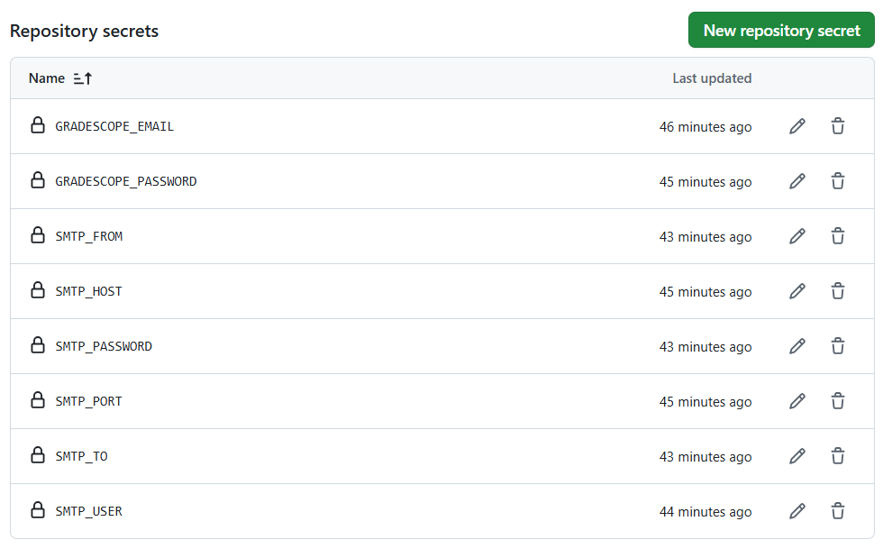
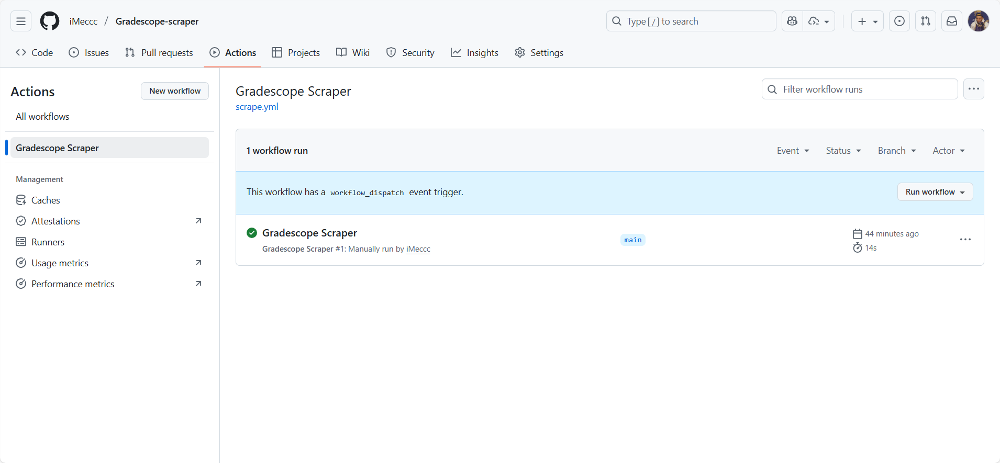
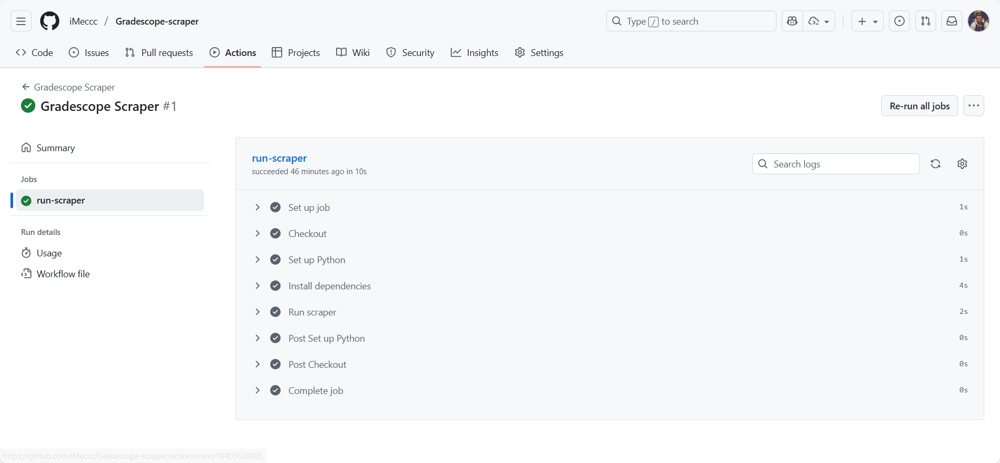

# Gradescope-scraper
## What is it?
Gradescope-scraper is a web crawler tool that could automatically fetch the submission status of homeworks released on Gradescope.

## What does it do?
- Automatically log into your gradescope account and check your homework submision status.
- If all works done, it will stay silent.
- If unsubmitted homework or newly-released homework detected, it will send a notification email to your box.
- Gradescope-scraper runs automatically at 7:00, 14:00, 19:00 Beijing Time(UTC 23:00, 6:00, 11:00)

## How can you run it?
- Turn to `Settings`->`Secrets and variables`->`Actions`->`New repository secret`, and input the following values:  
`GRADESCOPE_EMAIL`: your Gradescope log-in email (e.g. your.name@school.edu).  
`GRADESCOPE_PASSWORD`: your Gradescope password.  
`SMTP_HOST`: The SMTP host for email services (e.g. QQ email is smtp.qq.com, Gmail needs to be configured separately).  
`SMTP_PORT`: SMTP port (e.g. 465 for SSL, 587 for STARTTLS).  
`SMTP_USER`: SMTP account (your posting email, maybe just your own QQ email).  
`SMTP_PASSWORD`: SMTP authorization code/application-specific password (not the login password for the web version; for QQ email, the authorization code needs to be generated in "Account Settings -POP3/SMTP Service").  
`SMTP_TO`: receiving email, could be your oft-used email.  
`SMTP_FROM`: sending email, the same with your SMTP_USER email.  
e.g. 
- If you want to verify its accessibilty, turn to`Actions` on the top, choose`Gradescope Scraper` on the left and click`Run workflow`, then you can open the`run-scraper` and check the log.  

- That's all it takes. It will send you emails whenever homeworks occur unsubmitted.

---

## 中文.ver

## 它是什么？
Gradescope-scraper 是一个网页爬虫工具，用于自动获取 Gradescope 上作业的提交状态。

## 它能做什么？
- 自动登录你的 Gradescope 账户并检查作业提交状态。
- 如果所有作业都已完成，将保持静默。
- 如果检测到未提交作业或新发布的作业，会向你的邮箱发送通知。
- 程序会在北京时间 7:00、14:00、19:00 自动运行（对应 UTC 23:00、6:00、11:00）。

## 如何运行？
- 打开仓库 `Settings` → `Secrets and variables` → `Actions` → `New repository secret`，填入如下值：  
`GRADESCOPE_EMAIL`：你的 Gradescope 登录邮箱（例如 your.name@school.edu）。  
`GRADESCOPE_PASSWORD`：你的 Gradescope 登录密码。  
`SMTP_HOST`：邮件服务的 SMTP 主机（例如 QQ 邮箱为 smtp.qq.com；Gmail 需另行配置）。  
`SMTP_PORT`：SMTP 端口（例如 SSL 用 465，STARTTLS 用 587）。  
`SMTP_USER`：SMTP 账号（通常是你的发件邮箱地址，例如 你自己的QQ邮箱地址）。  
`SMTP_PASSWORD`：SMTP 授权码/应用专用密码（不是网页端登录密码；QQ邮箱需要在“账户设置-POP3/SMTP 服务”里生成授权码）。  
`SMTP_TO`：收件邮箱，可以是你常用的邮箱。  
`SMTP_FROM`：发件邮箱，通常与 `SMTP_USER` 相同。  
- 如需验证可用性：点击顶部 `Actions`，左侧选择 `Gradescope Scraper`，然后点击 `Run workflow`；接着打开 `run-scraper` 查看日志。  
- 就是这样。当存在未提交作业时，它会给你发送提醒邮件。

> 可以查看project_motivation以了解更多设计动机、编写流程和功能细节。